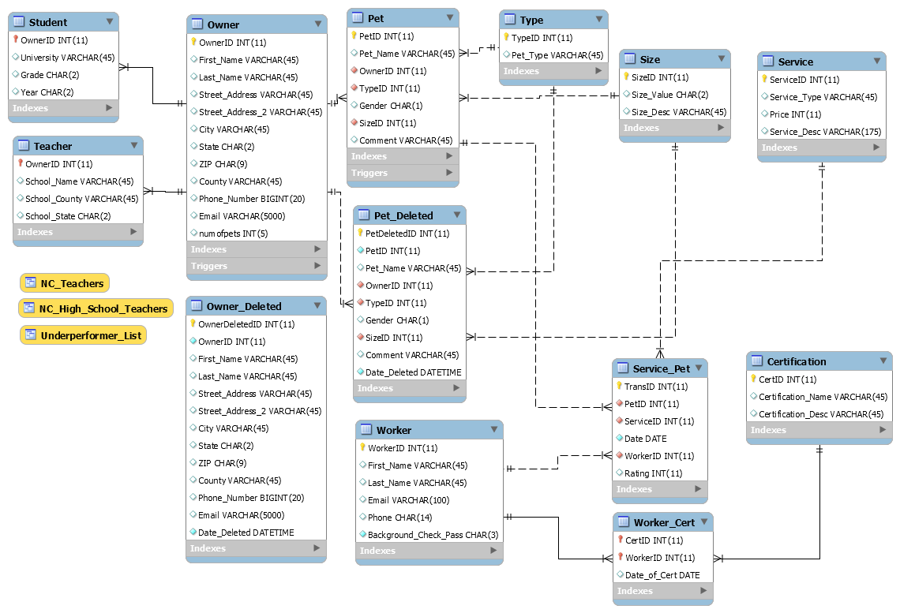

# DSBA-6160-Project

## Menu
* [Group Information](#group-information)
* [Executive Summary](#executive-summary)
* [Project Scope](#project-scope)
* [Business Rules](#business-rules)
* [EERD](#eerd)
* [Schema](#schema)
* [Data Dictionary](#data-dictionary)
* [Advanced SQL Statements](#advanced-sql-statements)
  * [Stored Procedures](#stored-procedures)
  * [Triggers](#triggers)
  * [Views](#views)
  * [Indexes](#indexes)
* [Database Backup Instructions](#database-backup-instructions)
  
## Group Information

<p align='left'>
    
</p>

**Name:** Go Getters

**Members:** Parker Jamison, Paul Blase, Khalil Khouy, Ashokanand Deo

**Description:** Our goal is to sucessfully complete our DSBA 6160 Project 

[back to top](#menu)

## Executive Summary
The ‘Go Getters’ project team will consist of Parker Jamison, Khalil Khouy, Paul Blasé and Ashokanand Deo.  The project will document the business rules set forth from the customer.  These business rules will guide the project team during the design of a fully normalized database system implemented in MySQL to replicate the functionality of rover.com for Dr. William Patel.  Dr. Patel would also like to enhance the functionality of his site by adding a training and certification class for the individual service providers.  This project will be completed by June 25th 2018 at the conclusion of the last class session.  During the course of the project we also convinced Dr. Patel that the pricing on some of his services was too low and has updated his price list with our recommendations.

[back to top](#menu)

## Project Scope
To realize the project’s success, the following deliverables must be achieved:
* Identify project group members, create a team name and take a group photo to put on the project’s GitHub page.
* Document the project’s scope
* Define the business rules
* Create an Enhanced Entity Relationship Diagram (EERD)
* Develop the database schema. 
* Create all schema objects using MySQL (Tables and Relationships)
* A data dictionary describing the meta data
* Documentation of the following:
  * Stored Procedures, Trigger, two advanced views using nested queries, group by, sort and conditional statements, transaction and Indexes for reports to optimize queries for the advanced views.   
  * A Simple web UI with screenshots utilizing Insert, Update, Delete for one table and Select statement for one of the reports (a video will also be ok).
  * Make GitHub site public.

[back to top](#menu)

## Business Rules
* Replicate functionality of www.rover.com
* Pets can be a dog or cat, but future functionality should support more pet types in the future
* Pet information is included in the data provided by Dr. Patel.
* Services must be described using type and cost attributes
* There are around 500 customers and Dr. Patel warns that some names are common and duplicated.
* Dr. Patel would like to focus on NC customers first but customers from other states can be included.
* Orders should be placed for one service at a time with a comments field for each service.
* A technician should be assigned to each order.
* Dr. Patel would like to identify customers whom are teachers to provide a 10% discount.
* Dr. Patel would like to identify college students as customers.
* Test data will need to be created to prototype this generalization and specialization
* Ratings should be provided for technicians once the service is provided.
* A user interface should be developed to support entering new or updating current customers and pets.
* Reports should be developed. 
* The DBMS should block transactions where Dr. Patel signs up technicians for a service that requires certification and the technician does not have it.
* Develop a ‘catchy’ name for Dr. Patel’s new product.
* Potential Individual providers must pass background check to be able to provide service. (Stretch Goals)
* Ratings for customers (Providers to rate the customers). (Stretch Goals)
* Customer Open-ended feedback, Providers’ Open-ended feedback. (Stretch Goals)
* Payroll for providers (1099 or W2(W/Benefits)). (Stretch Goals)
* Discount for providers when using the same service. (Stretch Goals)
* Military Discount, Student Discount, Senior Citizen Discount, Employer Discount. (Stretch Goals)

[back to top](#menu)

## EERD

<p align='left'>
    
</p>

[back to top](#menu)

## Schema

<p align='left'>
    
</p>

[back to top](#menu)

## Data Dictionary

This data dictionary was generated by using the following SQL command on the perservices database:

```SQL.mysql
SELECT 
    t.table_name AS 'Table Name',
    c.column_name AS 'Field Name',
    c.column_type AS 'Type',
    c.is_nullable AS 'Null',
    c.column_key AS 'Key',
    c.column_default AS 'Default'
FROM
    information_schema.tables AS t
        INNER JOIN
    information_schema.columns AS c ON t.table_name = c.table_name
        AND t.table_schema = c.table_schema
WHERE
    t.table_type IN ('base table')
        AND t.table_schema = 'petservice'
ORDER BY t.table_schema , t.table_name , c.ordinal_position
```
Code was borrorwed and modified from a [stackoverflow](https://stackoverflow.com/questions/9461826/mysql-show-datadictionary-of-tables) question

<table>
 <tr><td><strong>Table Name</strong></td><td> <strong>Field Name</strong></td><td> <strong>Type</strong></td><td> <strong>Null</strong></td><td> <strong>Key</strong></td><td> <strong>Default</strong></td></tr>
<tr><td>Certification</td><td> CertID</td><td> int(11)</td><td> NO</td><td> PRI</td><td> NULL</td></tr>
<tr><td>Certification</td><td> Certification_Name</td><td> varchar(45)</td><td> YES</td><td> </td><td> NULL</td></tr>
<tr><td>Certification</td><td> Certification_Desc</td><td> varchar(45)</td><td> YES</td><td> </td><td> NULL</td></tr>
<tr><td>Owner</td><td> OwnerID</td><td> int(11)</td><td> NO</td><td> PRI</td><td> NULL</td></tr>
<tr><td>Owner</td><td> First_Name</td><td> varchar(45)</td><td> YES</td><td> </td><td> NULL</td></tr>
<tr><td>Owner</td><td> Last_Name</td><td> varchar(45)</td><td> YES</td><td> </td><td> NULL</td></tr>
<tr><td>Owner</td><td> Street_Address</td><td> varchar(45)</td><td> YES</td><td> </td><td> NULL</td></tr>
<tr><td>Owner</td><td> Street_Address_2</td><td> varchar(45)</td><td> YES</td><td> </td><td> NULL</td></tr>
<tr><td>Owner</td><td> City</td><td> varchar(45)</td><td> YES</td><td> </td><td> NULL</td></tr>
<tr><td>Owner</td><td> State</td><td> char(2)</td><td> YES</td><td> </td><td> NULL</td></tr>
<tr><td>Owner</td><td> ZIP</td><td> char(9)</td><td> YES</td><td> </td><td> NULL</td></tr>
<tr><td>Owner</td><td> County</td><td> varchar(45)</td><td> YES</td><td> </td><td> NULL</td></tr>
<tr><td>Owner</td><td> Phone_Number</td><td> bigint(20)</td><td> YES</td><td> </td><td> NULL</td></tr>
<tr><td>Owner</td><td> Email</td><td> varchar(5000)</td><td> YES</td><td> </td><td> NULL</td></tr>
<tr><td>Pet</td><td> PetID</td><td> int(11)</td><td> NO</td><td> PRI</td><td> NULL</td></tr>
<tr><td>Pet</td><td> Pet_Name</td><td> varchar(45)</td><td> YES</td><td> </td><td> NULL</td></tr>
<tr><td>Pet</td><td> OwnerID</td><td> int(11)</td><td> NO</td><td> MUL</td><td> NULL</td></tr>
<tr><td>Pet</td><td> TypeID</td><td> int(11)</td><td> NO</td><td> MUL</td><td> NULL</td></tr>
<tr><td>Pet</td><td> Gender</td><td> char(1)</td><td> YES</td><td> </td><td> NULL</td></tr>
<tr><td>Pet</td><td> SizeID</td><td> int(11)</td><td> NO</td><td> MUL</td><td> NULL</td></tr>
<tr><td>Pet</td><td> Comment</td><td> varchar(45)</td><td> YES</td><td> </td><td> NULL</td></tr>
<tr><td>Service</td><td> ServiceID</td><td> int(11)</td><td> NO</td><td> PRI</td><td> NULL</td></tr>
<tr><td>Service</td><td> Service_Type</td><td> varchar(45)</td><td> YES</td><td> </td><td> NULL</td></tr>
<tr><td>Service</td><td> Price</td><td> int(11)</td><td> YES</td><td> </td><td> NULL</td></tr>
<tr><td>Service</td><td> Service_Desc</td><td> varchar(175)</td><td> YES</td><td> </td><td> NULL</td></tr>
<tr><td>Service_Pet</td><td> TransID</td><td> int(11)</td><td> NO</td><td> PRI</td><td> NULL</td></tr>
<tr><td>Service_Pet</td><td> PetID</td><td> int(11)</td><td> NO</td><td> MUL</td><td> NULL</td></tr>
<tr><td>Service_Pet</td><td> ServiceID</td><td> int(11)</td><td> NO</td><td> MUL</td><td> NULL</td></tr>
<tr><td>Service_Pet</td><td> Date</td><td> date</td><td> NO</td><td> </td><td> NULL</td></tr>
<tr><td>Service_Pet</td><td> WorkerID</td><td> int(11)</td><td> NO</td><td> MUL</td><td> NULL</td></tr>
<tr><td>Service_Pet</td><td> Rating</td><td> int(11)</td><td> YES</td><td> </td><td> NULL</td></tr>
<tr><td>Size</td><td> SizeID</td><td> int(11)</td><td> NO</td><td> PRI</td><td> NULL</td></tr>
<tr><td>Size</td><td> Size_Value</td><td> char(2)</td><td> YES</td><td> </td><td> NULL</td></tr>
<tr><td>Size</td><td> Size_Desc</td><td> varchar(45)</td><td> YES</td><td> </td><td> NULL</td></tr>
<tr><td>Student</td><td> OwnerID</td><td> int(11)</td><td> NO</td><td> PRI</td><td> NULL</td></tr>
<tr><td>Student</td><td> University</td><td> varchar(45)</td><td> YES</td><td> </td><td> NULL</td></tr>
<tr><td>Student</td><td> Grade</td><td> char(2)</td><td> YES</td><td> </td><td> NULL</td></tr>
<tr><td>Student</td><td> Year</td><td> char(2)</td><td> YES</td><td> </td><td> NULL</td></tr>
<tr><td>Teacher</td><td> OwnerID</td><td> int(11)</td><td> NO</td><td> PRI</td><td> NULL</td></tr>
<tr><td>Teacher</td><td> School_Name</td><td> varchar(45)</td><td> YES</td><td> </td><td> NULL</td></tr>
<tr><td>Teacher</td><td> School_County</td><td> varchar(45)</td><td> YES</td><td> </td><td> NULL</td></tr>
<tr><td>Teacher</td><td> School_State</td><td> char(2)</td><td> YES</td><td> </td><td> NULL</td></tr>
<tr><td>Type</td><td> TypeID</td><td> int(11)</td><td> NO</td><td> PRI</td><td> NULL</td></tr>
<tr><td>Type</td><td> Pet_Type</td><td> varchar(45)</td><td> YES</td><td> </td><td> NULL</td></tr>
<tr><td>Worker</td><td> WorkerID</td><td> int(11)</td><td> NO</td><td> PRI</td><td> NULL</td></tr>
<tr><td>Worker</td><td> First_Name</td><td> varchar(45)</td><td> YES</td><td> </td><td> NULL</td></tr>
<tr><td>Worker</td><td> Last_Name</td><td> varchar(45)</td><td> YES</td><td> </td><td> NULL</td></tr>
<tr><td>Worker</td><td> Email</td><td> varchar(100)</td><td> YES</td><td> </td><td> NULL</td></tr>
<tr><td>Worker</td><td> Phone</td><td> char(14)</td><td> YES</td><td> </td><td> NULL</td></tr>
<tr><td>Worker</td><td> Background_Check_Pass</td><td> char(3)</td><td> NO</td><td> </td><td> NULL</td></tr>
<tr><td>Worker_Cert</td><td> CertID</td><td> int(11)</td><td> NO</td><td> PRI</td><td> NULL</td></tr>
<tr><td>Worker_Cert</td><td> WorkerID</td><td> int(11)</td><td> NO</td><td> PRI</td><td> NULL</td></tr>
<tr><td>Worker_Cert</td><td> Date_of_Cert</td><td> date</td><td> YES</td><td> </td><td> NULL</td></tr>
</table>

[back to top](#menu)


## Advanced SQL Statements

### Stored Procedures

Two stored procedures were created to help initiate the creation of a order receipt.  

The first stored procedure, GET_BALANCE_FOR_PET, retreives all services and prices for a given pet. The inputs are PetID and Date of Visit 

```SQL.mysql

DROP PROCEDURE IF EXISTS GET_BALANCE_FOR_PET;

DELIMITER !!!

CREATE PROCEDURE GET_BALANCE_FOR_PET
(IN Petnumber int, IN Dateofservice DATE)
BEGIN
SELECT 
    A.Date,
    A.PetID,
    B.Service_Type AS 'Service',
    B.price AS 'Balance Due',
    CONCAT(C.First_Name, ' ', C.Last_Name) AS 'Customer Name',
    D.Pet_Name,
    E.Pet_Type
FROM
    Service_Pet A,
    Service B,
    Owner C,
    Pet D,
    Type E
WHERE
    A.ServiceID = B.ServiceID
        AND D.PetID = A.PetID
        AND C.OwnerID = D.OwnerID
        AND E.TypeID = D.TypeID
        AND A.petId = Petnumber
        AND A.Date = Dateofservice;
END !!!
DELIMITER ;

```
An example of it's use:

```SQL.mysql

CALL `petservice`.`GET_BALANCE_FOR_PET`(148, '2016-06-25');

```
<table>
	<tr><td><strong># Date</strong></td><td><strong>PetID</strong></td><td><strong>Service</strong></td><td><strong>Balance Due</strong></td><td><strong>Customer Name</strong></td><td><strong>Pet_Name</strong></td><td><strong>Pet_Type</strong></td></tr>
<tr><td>2016-06-25</td><td> 148</td><td> Weekday Services</td><td> 115</td><td> Joesph Degonia</td><td> Henry</td><td> Dog</td></tr>
<tr><td>2016-06-25</td><td> 148</td><td> Pet Taxi</td><td> 80</td><td> Joesph Degonia</td><td> Henry</td><td> Dog</td></tr>
<tr><td>2016-06-25</td><td> 148</td><td> Term Care</td><td> 65</td><td> Joesph Degonia</td><td> Henry</td><td> Dog</td></tr>
</table>

The second stored procedure, GET_SUMMARY_BILL_FOR_CUSTOMER, sums the price of the transaction and summarizes the order for the owner/customer.  The inputs are OwnerID and Date of Visit:

```SQl.mysql

DROP PROCEDURE IF EXISTS GET_SUMMARY_BILL_FOR_CUSTOMER;

DELIMITER !!!

CREATE PROCEDURE GET_SUMMARY_BILL_FOR_CUSTOMER
(IN CustomerNumber int, VisitDate date)
BEGIN
SELECT 
	SP.Date AS 'Visit_Date',
    O.First_Name,
    O.Last_Name,
    COUNT(DISTINCT SP.PetID) as 'Number_of_Pets',
    CONCAT('$', FORMAT(SUM(S.Price),2)) AS 'Total_Balance_Due',
    COUNT(Service_Type) AS 'Number_of_Services'
    
FROM
    Owner O
        JOIN
    Pet P ON O.OwnerID = P.OwnerID
        JOIN
    Service_Pet SP ON SP.PetID = P.PetID
        JOIN
    Service S ON S.ServiceID = SP.ServiceID
WHERE
    O.OwnerID = CustomerNumber and SP.Date = VisitDate;
END !!!
DELIMITER ;
```

An example of it's use:

```SQL.mysql
CALL `petservice`.`GET_SUMMARY_BILL_FOR_CUSTOMER`(177, '2016-06-25');
```
<table>
<tr><td><strong># Visit_Date</strong></td><td><strong>First_Name</strong></td><td><strong>Last_Name</strong></td><td><strong>Number_of_Pets</strong></td><td> <strong>Total_Balance_Due</strong></td><td><strong>Number_of_Services</strong></td></tr>
<tr><td>2016-06-25</td><td> Joesph</td><td> Degonia</td><td> 1</td><td> $260.00</td><td> 3</td></tr>
</table>


[back to top](#menu)


### Triggers

Three triggers were created to keep a count of how many pets an owner has in the database at any given time.  Each trigger was created on the Pet table to adjust the count accordingly.  

#### Code to add numofpets to Owner table:

```SQL.mysql

USE petservice;
ALTER  TABLE Owner ADD numofpets Int(5);
```
#### Code to perform a one-time update of numofpets to initally populate data:

```SQL.mysql
SET SQL_SAFE_UPDATES = 0;
UPDATE Owner SET numofpets=(SELECT COUNT(*)
					FROM Pet
                    WHERE `Pet`.`OwnerID` = Owner.OwnerID);
SET SQL_SAFE_UPDATES = 1;

```
#### ADDPET Trigger Definition:

```SQL.mysql
DROP TRIGGER IF EXISTS petservice.ADDPET;
-- ADD TRIGGER
 DELIMITER |
 CREATE TRIGGER ADDPET
 AFTER INSERT ON Pet
 FOR EACH ROW
 BEGIN
	 UPDATE Owner
		SET numofpets = numofpets + 1
        Where Owner.OwnerID = NEW.OwnerID;
 END |
 DELIMITER ;   
```

##### Test ADDPET Trigger
```SQL.mysql
 INSERT INTO `petservice`.`Pet` (`PetID`, `Pet_Name`, `OwnerID`, `TypeID`, `Gender`, `SizeID`, `Comment`) VALUES ('160', 'Spartacus', '3', '1', 'M', '4', 'Gentle Giant');
 ```

#### SWITCHPET Trigger Definition:

```SQL.mysql
DROP TRIGGER IF EXISTS petservice.SWITCHPET;
DELIMITER |
CREATE TRIGGER SWITCHPET
AFTER UPDATE ON Pet
FOR EACH ROW
	BEGIN
		UPDATE Owner
		SET numofpets = numofpets + 1
		WHERE Owner.OwnerID = NEW.OwnerID;
		UPDATE Owner
		SET numofpets = numofpets - 1
		WHERE Owner.OwnerID = OLD.OwnerID;
	END | 
DELIMITER ;
```
##### Test SWITCHPET Trigger:

```SQL.mysql

UPDATE Pet 
SET 
    OwnerID = 10
WHERE
    PetId = 160;

SELECT 
    *
FROM
    petservice.Owner
WHERE
    ownerid IN (3 , 10);
```

#### DROPPET Trigger Definition:

```SQL.mysql
DROP TRIGGER IF EXISTS petservice.DROPPET;
-- DROP TRIGGER
DELIMITER |
CREATE TRIGGER DROPPET
AFTER DELETE ON Pet
FOR EACH ROW
	BEGIN
		UPDATE Owner
        SET numofpets = numofpets - 1
        WHERE Owner.OwnerID = OLD.OwnerID;
	END |
DELIMITER ;
```
##### Test DROPPET Trigger:

```SQL.mysql
DELETE FROM Pet 
WHERE
    petId = '160';
SELECT 
    *
FROM
    Owner;
```

[back to top](#menu)


### Views

#### Teacher Views

For the views we used, we wanted to be able to create templates for any cases where Dr. Patel wanted to create offers for his clients whom are teachers or students. 

With the example provided below, focusing on teachers, he can utilize a view that shows his clientele that are teachers in North Carolina. This view's definition is:

```SQL.mysql

CREATE VIEW NC_Teachers AS
    SELECT 
        CONCAT(Owner.First_Name, ' ', Owner.Last_Name) AS OwnerName,
        CONCAT(Owner.Street_Address,
                ', ',
                Owner.City,
                ', ',
                Owner.State) AS Address,
        Owner.Phone_Number AS Phone,
        Owner.Email,
        Teacher.School_Name AS School
    FROM
        Owner
            INNER JOIN
        Teacher ON Owner.OwnerID = Teacher.OwnerID
    WHERE
        Owner.state = 'NC';
```
Additionally, with the High School Teachers as an example, he can provide different offers to teachers of high school students. However, this would also work if he wished to provide a deal for teachers from a specific school and wanted provide the front desk with a list of said teachers. This view's definition is:

```SQL.mysql
CREATE VIEW NC_High_School_Teachers AS
    SELECT 
        CONCAT(Owner.First_Name, ' ', Owner.Last_Name) AS OwnerName,
        CONCAT(Owner.Street_Address,
                ', ',
                Owner.City,
                ', ',
                Owner.State) AS Address,
        Owner.Phone_Number AS Phone,
        Owner.Email,
        Teacher.School_Name AS School
    FROM
        Owner
            INNER JOIN
        Teacher ON Owner.OwnerID = Teacher.OwnerID
    WHERE
        Owner.state = 'NC'
            AND teacher.School_Name LIKE '%high%';

SELECT 
    *
FROM
    NC_Teachers;
SELECT 
    *
FROM
    NC_High_School_Teachers;
```
#### Under Performing Technician 

For the underperformer listing, we wanted to provide a tool that offers Dr. Patel some capability to analyze customer-employee interaction. In this case, we are studying who are not preferred, showing the employees rated below average from lowest up to the average. Using this tool, Dr. Patel can quickly evaluate who is struggling with customers and can move forward to ensure that the situation surrounding said employee is handled appropriately. This can just as easily be transitioned into a tool to evaluate the top performers in the customer's eyes, which would allow Dr. Patel to reward overachievers in this aspect.

This view's definition is:

```SQL.mysql
CREATE VIEW Underperformer_List AS
    SELECT 
        w.First_Name,
        w.Last_Name,
        AVG(sp.Rating) AS 'AverageRating',
        COUNT(sp.Rating) AS 'ServicesPerformed'
    FROM
        Worker AS w
            LEFT JOIN
        Service_Pet AS sp ON w.WorkerID = sp.WorkerID
    GROUP BY w.WorkerID
    HAVING AverageRating IS NOT NULL
        AND AverageRating < (SELECT 
            AVG(Rating)
        FROM
            service_pet)
        AND ServicesPerformed >= 1
    ORDER BY AverageRating , ServicesPerformed DESC;

SELECT 
    *
FROM
    Underperformer_List;
```

[back to top](#menu)


### Indexes

#### Service_Pet Table Index
We chose this index to speed up queries where we are searching for a transaction by date
```SQl.mysql
ALTER TABLE service_pet ADD INDEX (date);
```
#### Owner Table Index
This index was chosen Speed up queries to determine if customers are in or out of the state of North Carolina
```SQl.mysql
ALTER TABLE Owner ADD INDEX (state);
```
#### Pet Table Index
Pets are most often searched by name.  This index improves efficency of queries where searching by Pet name is in the WHERE clause
```SQl.mysql
ALTER TABLE Pet ADD INDEX (Pet_Name(3));
```
#### Worker Table Indices
Searching by First and Last Name are often used to find technicians in the worker table.  Indexing will speed up these queries.  
```SQL.mysql
ALTER TABLE Worker ADD INDEX (Last_Name, First_Name);
ALTER TABLE Worker ADD INDEX (Last_Name);
```
#### Worker_Cert Table Index
We chose this index to speed up queries where we are searching for a technician's certification by date
```SQl.mysql
ALTER TABLE Worker_cert ADD INDEX (Date_of_Cert);
```
[back to top](#menu)

### Database Backup Instructions

The database in MySQL can be backed up by issuing the following command at the MySQL command line:

```
mysqldump.exe --defaults-file="<filepath_to_dump_file>"  --user=<username> --host=<hostname_of_instance> --protocol=tcp --port=3306 --default-character-set=utf8 --single-transaction=TRUE --routines "petservice"
```
Alternatively, Dr. Patel can use MySQL Workbench's GUI to perform a similar action using these settings and hitting the 'Start Export' button:

<p align='left'>
    
</p>

[back to top](#menu)
